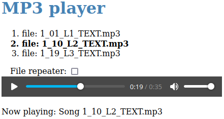

# Generated music player

Do you listen to music, language courses, or other audio files?
You may find a simple audio player generated into a single HTML file useful.
The advantage of such a player is the included playlist and easy portability between operating systems, so you can upload it to your mobile phone or tablet, for example.
However, it is not a problem to upload it to a web server as well.

The generator code is written in a single text file that runs with Java (version 17 or later) without the need for compilation.
To listen music, all you need is a web browser with HTML 5 and Javascript support.
The procedure for generating the HTML player is as follows:

1. Switch to the local directory with your `mp3` files.
2. Download the source file [Mp3PlayerGenerator.java](https://raw.githubusercontent.com/pponec/Mp3PlayerGenerator/main/Mp3PlayerGenerator.java) to the local directory.
3. Run the command: `java Mp3PlayerGenerator.java` from a command line. If the downloaded file is not in the current directory, you need to add the path to it.
4. The music player will be generated to the `index.html` file.
5. After opening the file in the web browser, select the required file from displayed playlist (by the mouse) a use the space bar to pause and resume.
   The playlist plays over and over again.

## More information:

* Homepage: https://github.com/pponec/Mp3PlayerGenerator/
* License: Apache License, Version 2.0
* Original solution was written in the [Kotlin script](original).